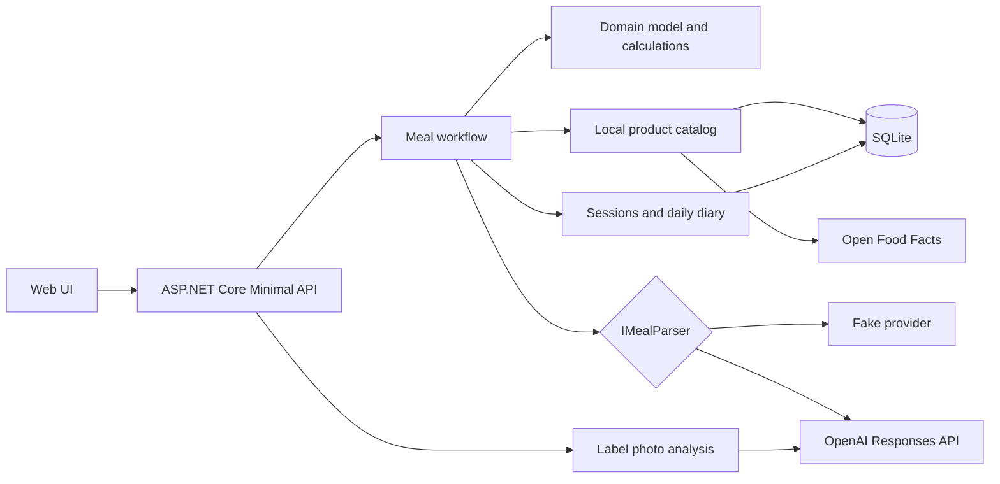

# NutriFlow

[](https://github.com/Vvvv4a40/NutriFlow/actions/workflows/ci.yml)

NutriFlow — веб-приложение для восстановления состава приготовленного блюда из последовательности сообщений, поиска данных о продуктах и детерминированного расчёта калорий, белков, жиров и углеводов.

Пользователю не нужно заранее раскладывать приготовление по форме с десятками полей. Он может постепенно сообщить, какие продукты и массы использовал, сколько весит готовое блюдо и какую порцию съел. NutriFlow собирает эти события в проверяемый черновик, показывает существенные неоднозначности и записывает результат в дневник только после подтверждения.

## Сквозной поток

```text
сообщения и фотография этикетки
              ↓
структурированный черновик и вопросы
              ↓
локальный каталог → Open Food Facts при поиске по штрихкоду
              ↓
детерминированный расчёт блюда и порций
              ↓
проверка пользователем и подтверждение
              ↓
дневник и прогресс относительно дневной цели
```

Пример входной последовательности:

```text
Добавил 600 г говядины.
Потом пачку овощной смеси и около 20 г масла.
Готовое рагу весит 1180 г.
Съел 350 г.
```

## Гарантии расчёта и данных

- AI извлекает структуру из текста и фотографии, но не рассчитывает итоговое КБЖУ.
- Все вычисления выполняются доменным C#-кодом с типом `decimal` и покрываются автоматическими тестами.
- Для продукта сохраняются происхождение данных, ссылка на источник и понятная оценка качества без выдуманных процентов уверенности.
- Поиск по штрихкоду сначала проверяет SQLite, а при локальном промахе обращается к Open Food Facts и кэширует валидный результат.
- Данные Open Food Facts сохраняются с качеством `Unknown`: успешный ответ пользовательской базы сам по себе не считается проверкой.
- Найденный по штрихкоду продукт можно связать с формулировкой ингредиента через локальный алиас; проверенные данные с тем же штрихкодом заменяют менее качественный внешний результат.
- Устаревший предпросмотр нельзя изменить или подтвердить: сервер условно обновляет сессию по `previewToken`, а порции записывает атомарно.
- Явно удалённая масса вычитается C#-кодом, а порция может быть задана массой или долей готового блюда.
- Предпросмотр отдельно показывает качество итога блюда, значения на 100 г и каждой рассчитанной порции до подтверждения.
- Итоговая запись дневника сохраняет худшую категорию качества среди продукта, исходных масс и порции.
- Фотография этикетки проверяется по сигнатуре файла; поддерживаются JPEG, PNG и WebP размером до 8 МБ, а сохранённый первоисточник можно открыть из предпросмотра.
- Промежуточные значения не округляются, чтобы сумма порций не расходилась с расчётом всего блюда.

Подробнее о продуктовых правилах: [docs/PRODUCT.md](docs/PRODUCT.md).

## Возможности

- веб-интерфейс для последовательного ввода сообщений, проверки черновика и подтверждения приёма пищи;
- постоянные сессии приёма пищи и повторная сборка предпросмотра после уточнения;
- расчёт КБЖУ всей партии, значения на 100 г и отдельных порций;
- дневная цель, съеденные порции, остаток и превышение по каждому показателю;
- локальный каталог SQLite с ручным вводом и сохранением происхождения данных;
- поиск упакованного продукта по штрихкоду через Open Food Facts с local-first кэшированием;
- разбор произвольного текста через OpenAI Responses API со строгой JSON-схемой;
- извлечение черновика КБЖУ из фотографии этикетки с обязательной проверкой перед сохранением;
- OpenAPI и Swagger UI в окружении `Development`;
- liveness- и readiness-проверки приложения.

## Архитектура



Зависимости направлены к доменному ядру: `Domain` не знает об HTTP, EF Core, SQLite или внешних сервисах. `Infrastructure` реализует хранение и интеграции, а `Api` соединяет компоненты и предоставляет HTTP-контракты.

| Проект | Ответственность |
| --- | --- |
| `NutriFlow.Domain` | Бизнес-модель, состояния и расчёты КБЖУ |
| `NutriFlow.Infrastructure` | SQLite, EF Core, Open Food Facts, OpenAI и хранение фотографий |
| `NutriFlow.Api` | Minimal API, сквозной workflow и веб-интерфейс |
| `NutriFlow.Console` | Изолированный сценарий расчёта через доменную модель |
| `NutriFlow.Domain.Tests` | Тесты доменных правил и арифметики |
| `NutriFlow.Infrastructure.Tests` | Тесты хранения и внешних адаптеров |
| `NutriFlow.Api.Tests` | Сквозные HTTP-тесты workflow |

## Быстрый запуск без внешних ключей

Требуется [.NET SDK 10.0.400](https://dotnet.microsoft.com/download/dotnet/10.0)
или более свежая patch-версия той же feature band. Выбор SDK закреплён в
`global.json`.

```powershell
dotnet tool restore
dotnet restore NutriFlow.sln --locked-mode --warnaserror
dotnet run --project NutriFlow.Api/NutriFlow.Api.csproj
```

После запуска доступны:

- приложение — `http://localhost:5198`;
- Swagger UI — `http://localhost:5198/swagger`;
- liveness — `http://localhost:5198/health/live`;
- readiness SQLite — `http://localhost:5198/health/ready`.

По умолчанию используется `FakeMealParser`, поэтому запуск не требует сетевого AI-вызова или секретов. Для воспроизводимого сценария:

1. Откройте веб-интерфейс.
2. Нажмите «Заполнить пример».
3. Соберите черновик, проверьте рассчитанные значения и подтвердите запись.
4. Убедитесь, что порции появились в дневном прогрессе.

Fake-провайдер принимает только заранее определённые последовательности. Поиск по штрихкоду через Open Food Facts остаётся настоящим сетевым запросом при отсутствии продукта в локальном каталоге.

## Подключение OpenAI

API-ключ не хранится в `appsettings.json` и не должен попадать в Git. Для локального запуска используется .NET User Secrets:

```powershell
dotnet user-secrets set "Ai:Provider" "OpenAI" --project NutriFlow.Api
dotnet user-secrets set "Ai:OpenAI:ApiKey" "<api-key>" --project NutriFlow.Api
dotnet run --project NutriFlow.Api/NutriFlow.Api.csproj
```

После переключения провайдера разбор сообщений и фотографий выполняется через OpenAI Responses API. Строгие схемы ответа не содержат поля для итоговой арифметики КБЖУ.

## HTTP API

| Метод и маршрут | Назначение |
| --- | --- |
| `GET /` | Веб-интерфейс |
| `GET /api/capabilities` | Получить доступные возможности текущего AI-провайдера |
| `POST /api/meal-sessions` | Создать сессию и рассчитанный предпросмотр |
| `GET /api/meal-sessions/{id}` | Получить актуальное состояние сессии |
| `POST /api/meal-sessions/{id}/messages` | Добавить уточнение и пересобрать предпросмотр |
| `POST /api/meal-sessions/{id}/confirm` | Подтвердить актуальный предпросмотр и записать порции |
| `PUT /api/daily-goals/{date}` | Создать или заменить дневную цель |
| `GET /api/daily-progress/{date}` | Получить цель, потребление, остаток и превышение |
| `POST /api/meal-drafts/parse` | Получить структурированный черновик без сохранения workflow |
| `POST /api/products/manual` | Сохранить продукт с ручными значениями |
| `POST /api/products/from-label` | Сохранить проверенные значения с этикетки |
| `POST /api/products/aliases` | Связать имя ингредиента с продуктом по штрихкоду |
| `GET /api/products?name=...` | Найти локальные продукты по точному нормализованному имени |
| `GET /api/products/barcode/{barcode}` | Найти продукт локально или через Open Food Facts |
| `POST /api/labels/analyze` | Получить проверяемый черновик из фотографии этикетки |
| `GET /api/label-photos/{fileName}` | Открыть сохранённую фотографию-источник по непрозрачной ссылке |
| `GET /health/live` | Проверить работоспособность процесса |
| `GET /health/ready` | Проверить доступность и актуальность схемы SQLite |

Полные тела запросов, ответы и коды ошибок доступны в Swagger UI при запуске в `Development`.

## Конфигурация

В переменных окружения вложенные ключи записываются через двойное подчёркивание: например, `Database__Path`.

| Ключ | Значение по умолчанию | Назначение |
| --- | --- | --- |
| `Database:Path` | `data/nutriflow.db` | Путь к файлу SQLite |
| `Database:ApplyMigrationsOnStartup` | `true` | Применять EF Core migrations перед приёмом запросов |
| `Storage:LabelPhotosPath` | `data/label-photos` | Каталог сохранённых фотографий этикеток |
| `OpenFoodFacts:BaseUrl` | `https://world.openfoodfacts.org/` | Базовый URL продуктового сервиса |
| `OpenFoodFacts:UserAgent` | URL репозитория NutriFlow | Идентификация клиента перед внешним сервисом |
| `Ai:Provider` | `Fake` | Провайдер разбора: `Fake` или `OpenAI` |
| `Ai:OpenAI:BaseUrl` | `https://api.openai.com/v1/` | Базовый URL OpenAI API |
| `Ai:OpenAI:Model` | `gpt-5.4-mini` | Модель для структурированного разбора |
| `Ai:OpenAI:ApiKey` | не задан | Секрет, обязательный для провайдера `OpenAI` |
| `Demo:SeedData` | `true` | Добавить воспроизводимые продукты для Fake-сценария |

## Проверка качества

```powershell
dotnet restore NutriFlow.sln --locked-mode --warnaserror
dotnet tool restore
dotnet build NutriFlow.sln --configuration Release --no-restore
dotnet test NutriFlow.sln --configuration Release --no-build --no-restore
dotnet format NutriFlow.sln --no-restore --verify-no-changes
dotnet tool run dotnet-ef migrations has-pending-model-changes `
  --project NutriFlow.Infrastructure/NutriFlow.Infrastructure.csproj `
  --startup-project NutriFlow.Api/NutriFlow.Api.csproj `
  --configuration Release `
  --no-build
dotnet list NutriFlow.sln package --include-transitive --vulnerable --no-restore
```

GitHub Actions выполняет тот же Release-конвейер, превращает предупреждения
восстановления пакетов, включая NuGet Audit, в ошибки и дополнительно собирает
Docker-образ. Тесты внешних адаптеров используют управляемые ответы HTTP и не
требуют настоящего OpenAI-ключа.

## Docker

```powershell
docker build --pull --tag nutriflow .
docker run --rm --name nutriflow `
  --publish 8080:8080 `
  --volume nutriflow-data:/data `
  nutriflow
```

Приложение будет доступно по адресу `http://localhost:8080`. Контейнер работает от непривилегированного пользователя, применяет миграции перед запуском HTTP endpoint и хранит SQLite вместе с фотографиями в постоянном volume `/data`.

Для внешнего развёртывания TLS завершается на reverse proxy или платформе, а OpenAI-ключ передаётся через её хранилище секретов.
При включении реального провайдера также нужно установить `Ai__Provider=OpenAI`
и `Demo__SeedData=false`; ключ нельзя передавать в образ или сохранять в Git.

## Источник Open Food Facts и лицензирование

Данные, полученные из Open Food Facts, сохраняют название сервиса и ссылку на
исходную карточку продукта. База Open Food Facts распространяется по ODbL, а
локальное кэширование не отменяет требования лицензии и атрибуции. Перед
распространением накопленной базы оператор должен проверить
[официальные условия использования](https://world.openfoodfacts.org/terms-of-use)
и [руководство Open Food Facts по лицензированию](https://openfoodfacts.github.io/openfoodfacts-server/api/tutorials/license-be-on-the-legal-side/).

## Ограничения эксплуатации

- SQLite рассчитан на один экземпляр NutriFlow с локальным постоянным диском. Горизонтальное масштабирование потребует серверной СУБД.
- Миграции при старте допустимы только при единственном экземпляре приложения. Перед обновлением с изменением схемы требуется резервная копия volume.
- Текущий HTTP API не содержит аутентификации и пользовательской изоляции.
  Базовый лимит внешних операций — 12 запросов в минуту с одного IP — не заменяет
  контроль доступа, поэтому публичное развёртывание с оплачиваемым AI-ключом пока
  недопустимо.
- За reverse proxy нельзя доверять произвольному `X-Forwarded-For`: адреса
  доверенных прокси должны быть настроены на конкретной платформе до использования
  IP как ключа ограничения запросов.
- Поиск Open Food Facts реализован для штрихкода; произвольный полнотекстовый поиск ингредиентов во внешнем каталоге пока отсутствует.
- Fake-провайдер предназначен для воспроизводимой демонстрации и не разбирает произвольный текст; интерфейс явно показывает этот режим и отключает недоступное распознавание фото.
- Для каталога пока нет отдельного редактирования и удаления: конфликтующие данные того же уровня качества требуют будущего явного сценария замены, а не перезаписываются автоматически.
- Фотографии сохраняются на локальный диск. Несколько экземпляров потребуют общего объектного хранилища.
- Качество внешних пищевых данных зависит от первоисточника, поэтому результат всегда показывается пользователю до подтверждения.
