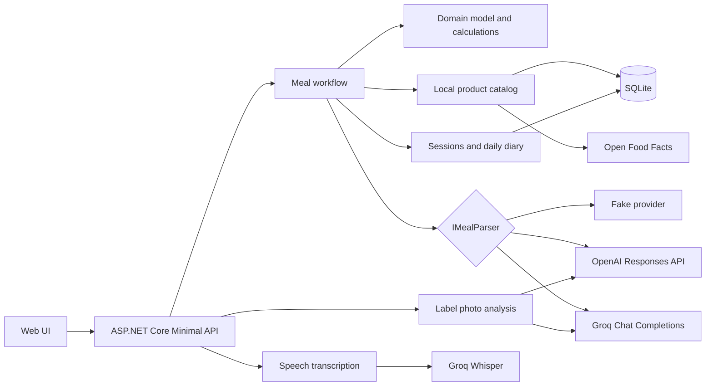

# NutriFlow

[](https://github.com/Vvvv4a40/NutriFlow/actions/workflows/ci.yml)

NutriFlow — бэкенд приложения для восстановления состава приготовленного блюда из последовательности сообщений, поиска данных о продуктах и детерминированного расчёта калорий, белков, жиров и углеводов. Целевой клиент — мобильное приложение; существующий веб-интерфейс служит временным клиентом для проверки серверных сценариев.

Пользователю не нужно заранее раскладывать приготовление по форме с десятками полей. Он может постепенно сообщить, какие продукты и массы использовал, сколько весит готовое блюдо и какую порцию съел. NutriFlow собирает эти события в проверяемый черновик, показывает существенные неоднозначности и записывает результат в дневник только после подтверждения.

[Навигация по коду](docs/CODE_MAP.md) · [Результаты ревью](docs/CODE_REVIEW.md)

## Сквозной поток

```text
сообщения и фотография этикетки
              ↓
структурированный черновик и вопросы
              ↓
локальный каталог → Open Food Facts при поиске по штрихкоду
              ↓
детерминированный расчёт блюда и порций
              ↓
проверка пользователем и подтверждение
              ↓
дневник и прогресс относительно дневной цели
```

Пример входной последовательности:

```text
Добавил 600 г говядины.
Потом пачку овощной смеси и около 20 г масла.
Готовое рагу весит 1180 г.
Съел 350 г.
```

## Гарантии расчёта и данных

- AI извлекает структуру из текста и фотографии, но не рассчитывает итоговое КБЖУ.
- Все вычисления выполняются доменным C#-кодом с типом `decimal` и покрываются автоматическими тестами.
- Для продукта сохраняются происхождение данных, ссылка на источник и понятная оценка качества без выдуманных процентов уверенности.
- Поиск по штрихкоду сначала проверяет SQLite, а при локальном промахе обращается к Open Food Facts и кэширует валидный результат.
- Данные Open Food Facts сохраняются с качеством `Unknown`: успешный ответ пользовательской базы сам по себе не считается проверкой.
- Ручные продукты, продукты из этикетки и алиасы личные; новый внешний импорт сохраняется отдельно в общий каталог. Личная версия того же штрихкода имеет приоритет, не изменяя общую запись или данные другого владельца.
- Устаревший предпросмотр нельзя изменить или подтвердить: сервер условно обновляет сессию по `previewToken`, а порции записывает атомарно.
- Явно удалённая масса вычитается C#-кодом, а порция может быть задана массой или долей готового блюда.
- Предпросмотр отдельно показывает качество итога блюда, значения на 100 г и каждой рассчитанной порции до подтверждения.
- Итоговая запись дневника сохраняет худшую категорию качества среди продукта, исходных масс и порции.
- Фотография этикетки проверяется по сигнатуре файла; поддерживаются JPEG, PNG и WebP размером до 8 МБ, а сохранённый первоисточник можно открыть из предпросмотра.
- Промежуточные значения не округляются, чтобы сумма порций не расходилась с расчётом всего блюда.

Подробнее о продуктовых правилах: [docs/PRODUCT.md](docs/PRODUCT.md).

## Возможности

- веб-интерфейс для последовательного ввода сообщений, проверки черновика и подтверждения приёма пищи;
- переключатель «Внести в дневник» / «Создать блюдо» над черновиком: сохранение собственного состава отдельно от съеденной порции;
- повторное использование собственных блюд по названию в естественном вводе, с сохранёнными КБЖУ и источниками ингредиентов;
- постоянные сессии приёма пищи и повторная сборка предпросмотра после уточнения;
- расчёт КБЖУ всей партии, значения на 100 г и отдельных порций;
- дневная цель, съеденные порции, остаток и превышение по каждому показателю;
- серверное исправление массы и исключение ошибочной порции из дневника, с сохранением исходного снимка и защитой от устаревших команд;
- локальный каталог SQLite с ручным вводом и сохранением происхождения данных;
- поиск упакованного продукта по штрихкоду через Open Food Facts с local-first кэшированием;
- разбор произвольного текста через Groq Chat Completions или OpenAI Responses API со строгой JSON-схемой;
- извлечение черновика КБЖУ из фотографии этикетки с обязательной проверкой перед сохранением;
- запись микрофона в браузере и расшифровка аудио через Groq с проверкой текста перед добавлением в сессию;
- OpenAPI и Swagger UI в окружении `Development`;
- liveness- и readiness-проверки приложения.

## Архитектура


```mermaid
flowchart LR
    Browser[Web UI] --> Api[ASP.NET Core Minimal API]
    Api --> Workflow[Meal workflow]
    Workflow --> Domain[Domain model and calculations]
    Workflow --> Catalog[Local product catalog]
    Workflow --> Diary[Sessions and daily diary]
    Catalog --> SQLite[(SQLite)]
    Diary --> SQLite
    Catalog --> OFF[Open Food Facts]
    Workflow --> Parser{IMealParser}
    Parser --> Fake[Fake provider]
    Parser --> OpenAI[OpenAI Responses API]
    Parser --> Groq[Groq Chat Completions]
    Api --> Labels[Label photo analysis]
    Labels --> OpenAI
    Labels --> Groq
    Api --> Speech[Speech transcription]
    Speech --> Whisper[Groq Whisper]
```

Зависимости направлены к доменному ядру: `Domain` не знает об HTTP, EF Core, SQLite или внешних сервисах. `Infrastructure` реализует хранение и интеграции, а `Api` соединяет компоненты и предоставляет HTTP-контракты.

| Проект | Ответственность |
| --- | --- |
| `NutriFlow.Domain` | Бизнес-модель, состояния и расчёты КБЖУ |
| `NutriFlow.Infrastructure` | SQLite, EF Core, Open Food Facts, AI-провайдеры и хранение фотографий |
| `NutriFlow.Api` | Minimal API, сквозной workflow и веб-интерфейс |
| `NutriFlow.Console` | Изолированный сценарий расчёта через доменную модель |
| `NutriFlow.Tools` | Offline-копирование, проверка и восстановление SQLite с фотографиями в новый каталог |
| `NutriFlow.Domain.Tests` | Тесты доменных правил и арифметики |
| `NutriFlow.Infrastructure.Tests` | Тесты хранения и внешних адаптеров |
| `NutriFlow.Api.Tests` | Сквозные HTTP-тесты workflow |

Начат отдельный нативный клиент на .NET MAUI: `mobile/NutriFlow.Mobile.slnx`, один общий проект с точками входа Android / iOS и первым статичным экраном. Windows по умолчанию выбирает Android, macOS — iOS; серверное solution и Docker-контекст независимы от клиента. `maui-android` установлен, Android SDK/JDK пользователь установит позже: сборка APK остановилась на `XA5300`. iOS успешно скомпилирован для ARM64-симулятора на облачном Mac; настоящий `packages.ios.lock.json` сохранён из артефакта [run 37472323523](https://github.com/Vvvv4a40/NutriFlow/actions/runs/37472323523). Запуск экрана, подпись и IPA для телефона не проверены. [Структура, список загрузок и команды мобильного клиента](docs/MOBILE_CLIENT.md).

Для проверки iOS без собственного Mac добавлен ручной [workflow iOS simulator](https://github.com/Vvvv4a40/NutriFlow/actions/workflows/ios-simulator.yml). [Повторная сборка](https://github.com/Vvvv4a40/NutriFlow/actions/runs/37648044029) приняла уже сохранённый lock-файл. Теперь workflow также создаёт отдельный iOS 26.0 симулятор, устанавливает приложение, проверяет его процесс и сохраняет PNG / диагностику; эта новая проверка ещё ожидает облачного запуска и просмотра снимка. Apple-аккаунт не нужен, IPA для iPhone не создаётся. Порядок запуска и границы результата описаны в мобильном руководстве.

## Быстрый запуск без внешних ключей

Требуется [.NET SDK 10.0.400](https://dotnet.microsoft.com/download/dotnet/10.0)
или более свежая patch-версия той же feature band. Выбор SDK закреплён в
`global.json`.

```powershell
dotnet tool restore
dotnet restore NutriFlow.sln --locked-mode --warnaserror
dotnet run --project NutriFlow.Api/NutriFlow.Api.csproj
```

После запуска доступны:

- приложение — `http://localhost:5198`;
- Swagger UI — `http://localhost:5198/swagger`;
- liveness — `http://localhost:5198/health/live`;
- readiness SQLite — `http://localhost:5198/health/ready`.

По умолчанию используется `FakeMealParser`, поэтому запуск не требует сетевого AI-вызова или секретов. Для воспроизводимого сценария:

1. Откройте веб-интерфейс.
2. Нажмите «Заполнить пример».
3. Соберите черновик, проверьте рассчитанные значения и подтвердите запись.
4. Убедитесь, что порции появились в дневном прогрессе.

Fake-провайдер принимает только заранее определённые последовательности. Поиск по штрихкоду через Open Food Facts остаётся настоящим сетевым запросом при отсутствии продукта в локальном каталоге.

### Собственное блюдо и дневник

Выберите «Создать блюдо», опишите название, ингредиенты, массы и итоговый вес готового блюда. Проверьте черновик и нажмите «Сохранить блюдо». Состав и рассчитанные КБЖУ сохраняются, но дневной рацион не изменяется. Затем переключитесь на «Внести в дневник» и напишите, например: «Съел 150 г моего рагу». Сервер использует сохранённые КБЖУ блюда, а съеденная порция попадает в дневник только после нового подтверждения.

В Fake-режиме воспроизводимый сценарий: «Создать блюдо» → «Заполнить пример» → собрать и сохранить «Демо-блюдо» → «Внести в дневник» → сообщение `Съел 100 г Демо-блюда.` → собрать и подтвердить. Результат порции: 160 ккал, 10 г белка, 8 г жира и 12 г углеводов; качество демонстрационных данных — `Unknown`. Произвольные названия и формулировки требуют настроенного Groq или OpenAI.

Сохранённое блюдо — неизменяемый снимок конкретного состава и готового веса, а не шаблон рецепта и не учёт оставшейся еды. Имена собственных блюд уникальны у владельца; другое блюдо с тем же именем не перезаписывает прежнее. Если имя совпадает с продуктом, но КБЖУ различаются, сервер показывает неоднозначность вместо произвольного выбора.

## Подключение Groq

Ключ создаётся в [Groq Console](https://console.groq.com/keys). Он не хранится в
`appsettings.json` и не должен попадать в Git. Для локального запуска используется
.NET User Secrets:

```powershell
dotnet user-secrets set "Ai:Provider" "Groq" --project NutriFlow.Api
dotnet user-secrets set "Ai:Groq:ApiKey" "<groq-api-key>" --project NutriFlow.Api
dotnet run --project NutriFlow.Api/NutriFlow.Api.csproj
```

После переключения разбор сообщений и фотографий выполняется облачной моделью
Groq через Chat Completions API. По умолчанию для обоих режимов выбрана
`qwen/qwen3.8-27b`; идентификаторы текстовой и vision-моделей вынесены в
конфигурацию. Ответ запрашивается по строгой JSON-схеме, а итоговое КБЖУ
по-прежнему рассчитывает только C#-код.

Для повторяемой проверки распознавания этикеток на Windows с PowerShell 7.2+
запустите API с Groq, затем выполните в другом терминале:

```powershell
pwsh -File .\scripts\Test-GroqLabel.ps1
```

Скрипт выполняет два настоящих AI-запроса: создаёт PNG с известными КБЖУ и
вариант только с кДж, сравнивает распознанные данные и проверяет сохранение
исходных изображений по SHA-256. Фотографии сохраняются обычным endpoint,
но продукты и записи дневника не создаются. Ключ скрипту не передаётся — его
использует уже запущенный API. Для другой локальной копии API можно указать
`-BaseUrl http://localhost:5199/`. Синтетические изображения проверяют этот
сценарий, но не заменяют проверку обычного фото этикетки.

### Распознавание речи

При выбранном провайдере `Groq` тот же ключ используется для отдельного
[Speech-to-Text API](https://console.groq.com/docs/speech-to-text).
По умолчанию выбрана модель `whisper-large-v3-turbo` и русский язык (`ru`).
Текстовая модель разбирает уже полученную расшифровку; Whisper отвечает только
за превращение звука в текст.

В веб-интерфейсе очистите поле нового сообщения, нажмите **Записать голос** и
самостоятельно разрешите браузеру доступ к микрофону. Нажмите **Остановить и
распознать**, проверьте названия и массы, исправьте текст при необходимости и
только затем нажмите **Добавить сообщение**. Расшифровка не добавляется в сессию
автоматически и не подтверждает запись дневника. Уже введённый текст нельзя
перезаписать голосом: сначала добавьте его как сообщение или очистите поле.

Запись ограничена 60 секундами и 8 MiB. Подходящий формат WebM, MP4 или Ogg
выбирается из поддерживаемых браузером; если нужного формата или серверной
возможности нет, кнопка отключается с пояснением. **Отмена**, уход со страницы
или переключение вкладки прекращают голосовой ввод и освобождают микрофон.
Если расшифровка уже отправлена, отмена прерывает ожидание и игнорирует поздний
результат, но не гарантирует, что Groq ещё не получил аудио.

Доступ к микрофону требует [защищённого контекста: HTTPS или локального
localhost](https://developer.mozilla.org/en-US/docs/Web/API/MediaDevices/getUserMedia).
На телефоне обычный HTTP-адрес ноутбука в локальной сети для записи не подходит.
Сервер разрешает микрофон только своему origin; согласие браузера всё равно
выдаёт пользователь. Ключ Groq остаётся на сервере.

После перезапуска API откройте `/swagger`, выберите
`POST /api/audio/transcribe`, нажмите **Try it out** и загрузите файл в поле
`audio`. Поддерживаются WAV, MP3, WebM, M4A и Ogg размером до 8 MiB.
Запрос использует `multipart/form-data`: это формат HTTP-тела с отдельными
частями, в том числе файлами. Ответ имеет вид:

```json
{"text":"Добавил примерно 600 граммов говядины."}
```

Проверьте названия и массы в тексте, при необходимости исправьте его и добавьте
через обычное поле сообщений веб-интерфейса. Endpoint сам не создаёт сессию,
продукты или записи дневника. Приложение не сохраняет аудио постоянно;
ASP.NET Core может временно буферизовать загрузку на диск.

Сервер проверяет размер, заголовок контейнера и соответствие MIME-типа,
но не декодирует аудиодорожку: её пригодность для распознавания проверяет Groq.
Расшифровка ограничена 4000 символами — размером одного сообщения.
Нет файла или он неверного формата — `400`; речь не распознана — `422`;
сбой провайдера — `502`; недоступный режим — `503`; таймаут — `504`.
Действует общий лимит внешних операций с ответом `429`.

Для воспроизводимой сетевой проверки на Windows с PowerShell 7.2+ и установленным
русским голосом синтеза речи:

```powershell
pwsh -File .\scripts\Test-GroqSpeech.ps1
```

Скрипт создаёт WAV в памяти, выполняет два настоящих запроса через уже
запущенный API — расшифровку и разбор текста — и проверяет массы 600, 500 и 250 г
в черновике. Ключ скрипту не передаётся, данные дневника и каталога не меняются.
Другой адрес можно указать через `-BaseUrl http://localhost:5199/`.
Синтезированная запись проверяет заданный сценарий, но не качество распознавания
реальной речи, шума или акцента.

## Подключение OpenAI

API-ключ не хранится в `appsettings.json` и не должен попадать в Git. Для локального запуска используется .NET User Secrets:

```powershell
dotnet user-secrets set "Ai:Provider" "OpenAI" --project NutriFlow.Api
dotnet user-secrets set "Ai:OpenAI:ApiKey" "<api-key>" --project NutriFlow.Api
dotnet run --project NutriFlow.Api/NutriFlow.Api.csproj
```

После переключения провайдера разбор сообщений и фотографий выполняется через OpenAI Responses API. Строгие схемы ответа не содержат поля для итоговой арифметики КБЖУ.

## HTTP API

| Метод и маршрут | Назначение |
| --- | --- |
| `GET /` | Веб-интерфейс |
| `GET /api/capabilities` | Получить доступные возможности текущего AI-провайдера |
| `POST /api/meal-sessions` | Создать сессию дневника или сохранения блюда и рассчитанный предпросмотр |
| `GET /api/meal-sessions/{id}` | Получить актуальное состояние сессии |
| `POST /api/meal-sessions/{id}/messages` | Добавить уточнение и пересобрать предпросмотр |
| `POST /api/meal-sessions/{id}/confirm` | Подтвердить актуальный предпросмотр: записать порции либо сохранить блюдо |
| `GET /api/saved-dishes` | Получить собственные сохранённые блюда |
| `GET /api/saved-dishes/{id}` | Получить сохранённый состав, источники и КБЖУ блюда |
| `PUT /api/daily-goals/{date}` | Создать или заменить дневную цель |
| `GET /api/daily-progress/{date}` | Получить цель, потребление, остаток и превышение |
| `GET /api/meal-entries/{id}` | Получить текущую порцию и ETag её версии |
| `PUT /api/meal-entries/{id}` | Исправить массу и пересчитать КБЖУ из исходного снимка; требуется `If-Match` |
| `DELETE /api/meal-entries/{id}` | Исключить порцию из дневника без удаления исходного снимка; требуется `If-Match` |
| `POST /api/meal-drafts/parse` | Получить структурированный черновик без сохранения workflow |
| `POST /api/products/manual` | Сохранить продукт с ручными значениями |
| `POST /api/products/from-label` | Сохранить проверенные значения с этикетки |
| `POST /api/products/aliases` | Связать имя ингредиента с продуктом по штрихкоду |
| `GET /api/products?name=...` | Найти локальные продукты по точному нормализованному имени |
| `GET /api/products/barcode/{barcode}` | Найти продукт локально или через Open Food Facts |
| `POST /api/labels/analyze` | Получить проверяемый черновик из фотографии этикетки |
| `POST /api/audio/transcribe` | Получить текст из аудиофайла для проверки пользователем |
| `GET /api/label-photos/{fileName}` | Открыть сохранённую фотографию-источник по непрозрачной ссылке |
| `GET /health/live` | Проверить работоспособность процесса |
| `GET /health/ready` | Проверить доступность и актуальность схемы SQLite |

Полные тела запросов, ответы и коды ошибок доступны в Swagger UI при запуске в `Development`.

Все ответы маршрутов `/api` имеют `Cache-Control: private, no-store`, включая ошибки и фотографии. Это запрещает HTTP-кэширование личных ответов и устаревшего дневного баланса; локальный каталог SQLite при этом продолжает работать. `ETag` порций сохраняется для проверки `If-Match`. Правило не меняет кэширование статических файлов, Swagger и служебных проверок и не заменяет вход или HTTPS.

[Контракт для мобильного клиента](docs/MOBILE_API.md) описывает форматы данных,
состояния, подтверждение и безопасные повторы после обрыва связи. Подтверждение
одной сессии с тем же токеном не создаёт повторных порций; создание сессии и
добавление сообщения поддерживают повторы с `Idempotency-Key`. В Production ошибки маршрутов `/api`
с пустым телом дополняются `application/problem+json`. Хранилища дневника и каталога
разделяют владельцев, но HTTP использует одного локального пользователя без проверки
личности. Фотографии также ограничены владельцем; незарегистрированный файл не
выдаётся по одному лишь имени. API не следует открывать публично.

Порции в дневнике и ответах подтверждения содержат `id` и `revision`. Коррекция веса использует `PUT /api/meal-entries/{id}` с `If-Match: "<revision>"`; тело содержит положительный `weightInGrams` и необязательный `weightQuality` (`Exact` / `Estimated`). Устаревшая версия даёт `412`, отсутствующая — `428`. Удаление использует такой же заголовок и возвращает `204`; повтор подтверждения не восстанавливает убранные порции. Текущий веб-клиент не содержит кнопок этих операций — они доступны серверным клиентам и через Swagger. Исправление состава, названия, даты и восстановление удалённой порции не входят в этот контракт.

## Конфигурация

В переменных окружения вложенные ключи записываются через двойное подчёркивание: например, `Database__Path`.

| Ключ | Значение по умолчанию | Назначение |
| --- | --- | --- |
| `Database:Path` | `data/nutriflow.db` | Путь к файлу SQLite |
| `Database:ApplyMigrationsOnStartup` | `true` | Применять EF Core migrations и однократно регистрировать старые фотографии перед приёмом запросов |
| `Storage:LabelPhotosPath` | `data/label-photos` | Каталог сохранённых фотографий этикеток |
| `OpenFoodFacts:BaseUrl` | `https://world.openfoodfacts.org/` | Базовый URL продуктового сервиса |
| `OpenFoodFacts:UserAgent` | URL репозитория NutriFlow | Идентификация клиента перед внешним сервисом |
| `Ai:Provider` | не задан; в Development — `Fake` | Обязательный выбор: `Fake`, `Groq` или `OpenAI` |
| `Ai:OpenAI:BaseUrl` | `https://api.openai.com/v1/` | Базовый URL OpenAI API |
| `Ai:OpenAI:Model` | `gpt-5.4-mini` | Модель для структурированного разбора |
| `Ai:OpenAI:ApiKey` | не задан | Секрет, обязательный для провайдера `OpenAI` |
| `Ai:Groq:BaseUrl` | `https://api.groq.com/openai/v1/` | Базовый URL Groq API |
| `Ai:Groq:TextModel` | `qwen/qwen3.8-27b` | Модель для разбора сообщений |
| `Ai:Groq:VisionModel` | `qwen/qwen3.8-27b` | Модель для чтения этикеток |
| `Ai:Groq:SpeechModel` | `whisper-large-v3-turbo` | Модель для расшифровки аудио |
| `Ai:Groq:SpeechLanguage` | `ru` | Двухбуквенный код языка; пустое значение включает автоматическое определение |
| `Ai:Groq:ApiKey` | не задан | Секрет, обязательный для провайдера `Groq` |
| `Demo:SeedData` | `false`; в Development — `true` | Явно добавить воспроизводимые продукты для Fake-сценария |

Общий `appsettings.json` не выбирает AI-провайдера и не включает демо-наполнение. `appsettings.Development.json` сохраняет прежний локальный Fake-сценарий. Обычный `dotnet run --project NutriFlow.Api` использует профиль `http` с окружением Development; User Secrets могут переопределить его, например выбрать Groq. Переменные окружения и аргументы командной строки имеют приоритет над JSON-настройками.

В Production / Staging нужно явно задать `Ai:Provider`. Пустое значение, неизвестный провайдер и отсутствие ключа у Groq / OpenAI останавливают запуск до создания хранилища и миграций; ошибочное булево значение `Demo:SeedData` также проверяется в начале `Program`. Явный `Fake` разрешён для пробных запусков из резервной копии. Демо-продукты появляются только при сочетании `Fake` и `Demo:SeedData=true` — включайте это на отдельной демонстрационной базе.

Это проверка выбора провайдера и наличия ключа, а не проверка доступа к внешнему сервису: правильность ключа, доступность модели и ответа проверяются при соответствующем запросе. Изменение настроек не добавляет аутентификацию и не разрешает публичное размещение.

## Проверка качества

```powershell
dotnet restore NutriFlow.sln --locked-mode --warnaserror
dotnet tool restore
dotnet build NutriFlow.sln --configuration Release --no-restore
dotnet test NutriFlow.sln --configuration Release --no-build --no-restore
pwsh -NoProfile -File scripts/Test-MealWorkflow.ps1
pwsh -NoProfile -File scripts/Test-Publish.ps1
node --check NutriFlow.Api/wwwroot/js/app.js
node --test scripts/tests/*.test.mjs
dotnet format NutriFlow.sln --no-restore --verify-no-changes
dotnet list NutriFlow.sln package --include-transitive --vulnerable --no-restore
```

`scripts/Test-MealWorkflow.ps1` требует PowerShell 7.2+ и заранее собранный Release-проект API. Он запускает отдельный сервер в Production с Fake, искусственной SQLite и демо-продуктами в новом временном каталоге. Проверяет создание блюда без дневниковой записи, внесение его порции, дробные КБЖУ, повторы и сохранность после перезапуска. HTTP идёт через настоящий Kestrel на случайном порту `127.0.0.1`, а не через встроенный тестовый сервер.

Скрипт не использует рабочую базу, архивы, локальные настройки и ключи: окружение очищается только у дочернего процесса, пути хранилища задаются явно. Внешний продуктовый адрес заменён loopback-адресом. Останавливается только собственный API; искусственное хранилище остаётся по напечатанному пути для просмотра. Каждый запуск создаёт новый каталог. Для Debug используйте `-Configuration Debug` после соответствующей сборки. Это проверка серверного сценария, не настоящего Groq, старых данных, телефона или защищённого публичного сервиса.

Проверку EF-модели выполняйте в отдельном терминале с явным провайдером без настоящих ключей и без миграций:

```powershell
$env:Ai__Provider = 'Fake'
$env:Demo__SeedData = 'false'
$env:Database__ApplyMigrationsOnStartup = 'false'
dotnet tool run dotnet-ef migrations has-pending-model-changes `
  --project NutriFlow.Infrastructure/NutriFlow.Infrastructure.csproj `
  --startup-project NutriFlow.Api/NutriFlow.Api.csproj `
  --configuration Release `
  --no-build
```

После проверки закройте этот терминал перед обычным запуском: его переменные окружения иначе переопределят локальный выбор AI. В CI эти значения действуют только на шаг проверки модели.

Для JavaScript-проверок используется Node.js 24 без npm-пакетов. Он нужен только
для этих команд, а не для запуска приложения. Встроенный `node:test` проверяет
аудиомодуль и его связь с полем сообщения на управляемых заменах браузерных API;
эти проверки не заменяют ручную запись с настоящего микрофона.

GitHub Actions выполняет тот же Release-конвейер, включая JavaScript-тесты, отдельный серверный сценарий и проверку состава публикации, превращает предупреждения
восстановления пакетов, включая NuGet Audit, в ошибки и дополнительно собирает
Docker-образ. Тесты внешних адаптеров используют управляемые ответы HTTP и не
требуют настоящих ключей Groq или OpenAI.

## Пакет приложения

`dotnet publish` собирает файлы для запуска на другом компьютере; он не запускает API и не переносит рабочую базу. `.gitignore` управляет Git, `.dockerignore` — контекстом сборки Docker, а `DefaultItemExcludes` в `NutriFlow.Api.csproj` — автоматическим включением файлов SDK. Эти правила независимы.

Из сборки и публикации исключены каталоги `data`, `backups`, `label-photos`, файлы `.env` / `.env.*`, `appsettings.Local.json`, SQLite-файлы с расширениями `.db*` / `.sqlite*` и ключи / сертификаты `.pfx`, `.p12`, `.pem`, `.key`, в том числе во вложенных каталогах. Публичные `appsettings.json`, `appsettings.Development.json` и обычные файлы `wwwroot` остаются в пакете. Development-конфиг не включает демо при запуске в Production.

`scripts/Test-Publish.ps1` требует PowerShell 7.2+, Git и .NET SDK. Он копирует только отслеживаемые публичные исходники в отдельный временный каталог, добавляет 43 искусственных приватных файла, восстанавливает пакеты с lock-файлами и выполняет настоящую публикацию. Проверяются оба выхода — `bin` и publish: отсутствие приватных файлов и их маркера, наличие DLL и неизменность публичных настроек / интерфейса. Рабочее хранилище и User Secrets не копируются; приложение не запускается. При успехе только временная проверочная копия удаляется, при ошибке сохраняется с указанием пути.

Для отдельного пакета используйте новую пустую папку вне дерева исходников:

```powershell
$publishDirectory = Join-Path ([System.IO.Path]::GetTempPath()) "nutriflow-package-$([guid]::NewGuid().ToString('N'))"
dotnet publish NutriFlow.Api/NutriFlow.Api.csproj --configuration Release --no-restore --output $publishDirectory /p:UseAppHost=false
```

Правила исключения не удаляют файлы из ранее собранных пакетов. Не публикуйте поверх старой папки, в которой могли остаться личные файлы. Это также не поиск секретов по содержимому: ключ нельзя записывать в публичные настройки или C#-код. Данные хранятся отдельно от пакета, секреты передаются через User Secrets локально или хранилище секретов платформы при размещении.

## Docker

```powershell
docker build --pull --tag nutriflow .
docker run --rm --name nutriflow `
  --publish 127.0.0.1:8080:8080 `
  --env Ai__Provider=Fake `
  --env Demo__SeedData=true `
  --volume nutriflow-demo-data:/data `
  nutriflow
```

Это явно включённый локальный демо-запуск по адресу `http://localhost:8080` с отдельным volume. Образ задаёт Production, не выбирает AI-провайдера и отключает демо по умолчанию; без явного провайдера контейнер остановится. Контейнер работает от непривилегированного пользователя, применяет миграции перед запуском HTTP endpoint и хранит SQLite вместе с фотографиями в постоянном volume `/data`.

Для внешнего развёртывания TLS завершается на reverse proxy или платформе, а
ключ AI-провайдера передаётся через её хранилище секретов. Для Groq нужно
установить `Ai__Provider=Groq`, `Ai__Groq__ApiKey` и `Demo__SeedData=false`;
ключ нельзя передавать в образ или сохранять в Git.

## Источник Open Food Facts и лицензирование

Данные, полученные из Open Food Facts, сохраняют название сервиса и ссылку на
исходную карточку продукта. База Open Food Facts распространяется по ODbL, а
локальное кэширование не отменяет требования лицензии и атрибуции. Перед
распространением накопленной базы оператор должен проверить
[официальные условия использования](https://world.openfoodfacts.org/terms-of-use)
и [руководство Open Food Facts по лицензированию](https://openfoodfacts.github.io/openfoodfacts-server/api/tutorials/license-be-on-the-legal-side/).

## Ограничения эксплуатации

Перед обновлением схемы остановите API и создайте копию обеих частей хранилища:

```powershell
dotnet run --project NutriFlow.Tools -- backup --database NutriFlow.Api/data/nutriflow.db --photos NutriFlow.Api/data/label-photos --output NutriFlow.Api/data/backups/manual-20261005 --offline
dotnet run --project NutriFlow.Tools -- verify --backup NutriFlow.Api/data/backups/manual-20261005
dotnet run --project NutriFlow.Tools -- restore --backup NutriFlow.Api/data/backups/manual-20261005 --output NutriFlow.Api/data/validation/restored-20261006
```

Укажите фактические пути своей установки и новое имя назначения. Для `backup` параметр `--offline` — подтверждение остановки всех процессов записи, не автоматическая проверка. `restore` проверяет архив и восстанавливает только в ещё не существующий каталог; архив и пути не должны меняться другими программами. Утилита не меняет исходную базу, не применяет миграции, не перезаписывает существующие копии и не переключает API на результат. [Формат, проверки, ограничения и пробный запуск API из отдельной копии](docs/BACKUPS.md). Не запускайте API непосредственно внутри архива: миграции изменят проверенные файлы.

- SQLite рассчитан на один экземпляр NutriFlow с локальным постоянным диском. Горизонтальное масштабирование потребует серверной СУБД.
- Миграции при старте допустимы только при единственном экземпляре приложения. Перед обновлением с изменением схемы требуется резервная копия volume.
- Текущий HTTP API не содержит аутентификации: хранилища, включая фотографии, выбирают одного локального владельца.
  Базовый лимит внешних операций — 12 запросов в минуту с одного IP — не заменяет
  контроль доступа, поэтому публичное развёртывание с оплачиваемым AI-ключом пока
  недопустимо.
- За reverse proxy нельзя доверять произвольному `X-Forwarded-For`: адреса
  доверенных прокси должны быть настроены на конкретной платформе до использования
  IP как ключа ограничения запросов.
- Поиск Open Food Facts реализован для штрихкода; произвольный полнотекстовый поиск ингредиентов во внешнем каталоге пока отсутствует.
- Fake-провайдер предназначен для воспроизводимой демонстрации и не разбирает произвольный текст; интерфейс явно показывает этот режим и отключает недоступное распознавание фото.
- Для каталога пока нет отдельного редактирования и удаления: конфликтующие данные того же уровня качества требуют будущего явного сценария замены, а не перезаписываются автоматически.
- Фотографии сохраняются на локальный диск, метаданные владельцев — в SQLite. Резервировать и восстанавливать нужно обе части вместе; до первого обновлённого запуска необходимо проверить пути хранения. Старые файлы импортируются один раз, смена каталога не сбрасывает отметку импорта. Несколько экземпляров потребуют общего объектного хранилища.
- Качество внешних пищевых данных зависит от первоисточника, поэтому результат всегда показывается пользователю до подтверждения.
